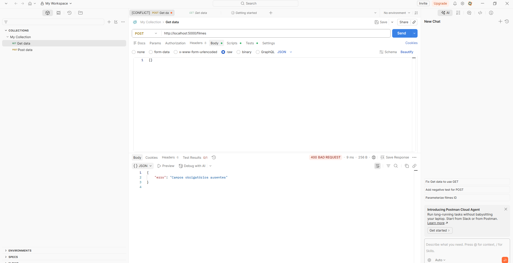
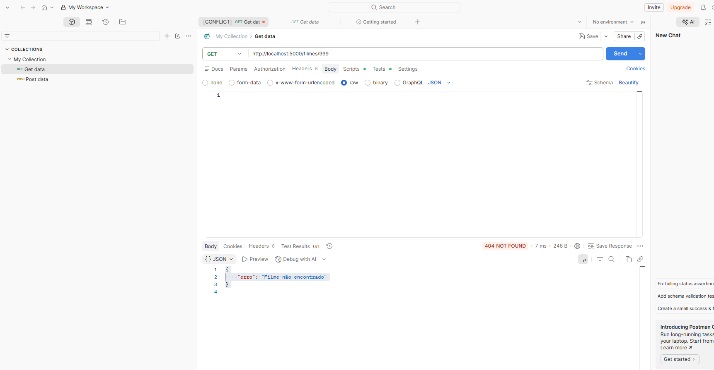
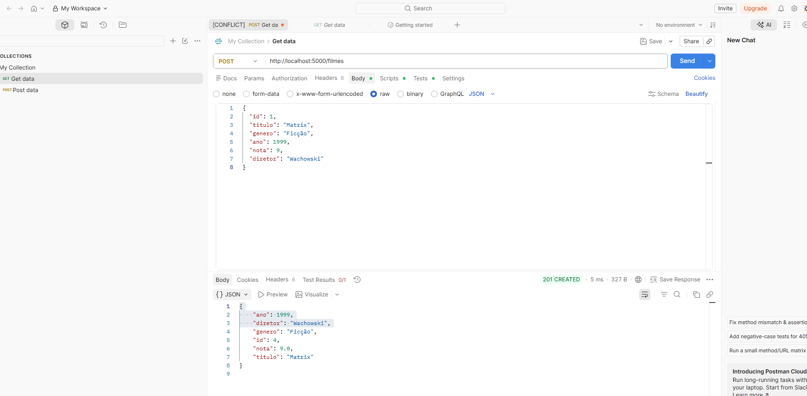

# API Fullstack de Catálogo de Filmes

API REST em Flask com interface web para gerenciamento de um catálogo de filmes em memória, desenvolvida com o auxílio do OpenCode e padronizada via `AGENTS.md` e Skills personalizadas.


## Funcionalidades
- CRUD completo de filmes (Criar, Listar, Buscar, Editar, Excluir)
- Campos: título, gênero, ano, nota (0-10) e diretor
- Validações de campos obrigatórios, nota (0-10) e formato de ano (4 dígitos)
- Filtro de filmes por gênero e por diretor (comparação sem diferenciar maiúsculas/minúsculas)
- Adição dinâmica de campos via Skill (`.opencode/command/campo-novo.md`) — usada para incluir o campo `diretor`
- Criação padronizada de novas rotas de filtro via Skill (`.opencode/command/nova-rota-filtro.md`)
- Interface Web integrada (HTML/CSS/JS) servida pelo próprio Flask
- Painel indicador de estatísticas em tempo real (Total de filmes e Média das notas)

## Arquitetura Simplificada
O projeto segue o padrão Cliente-Servidor com os dados armazenados em memória durante a execução:

`Frontend (Navegador)` ➔ `Flask (Rotas/API)` ➔ `Validação (Regras de Negócio)` ➔ `Lista em Memória (Python)`

## Endpoints REST
| Método | Rota | Descrição | Status HTTP |
|---|---|---|---|
| GET | `/filmes` | Lista todos os filmes | 200 |
| GET | `/filmes/<id>` | Busca um filme por ID | 200 / 404 |
| GET | `/filmes/genero/<genero>` | Filtra filmes por gênero | 200 |
| GET | `/filmes/diretor/<diretor>` | Filtra filmes por diretor | 200 |
| POST | `/filmes` | Cadastra um novo filme | 201 / 400 |
| PUT | `/filmes/<id>` | Atualiza um filme | 200 / 400 / 404 |
| DELETE | `/filmes/<id>` | Remove um filme | 204 / 404 |

## Como Rodar Localmente
```bash
# Criar e ativar o ambiente virtual
py -m venv .venv
.venv\Scripts\activate

# Instalar dependências
pip install flask flask-cors

# Executar a aplicação
python app.py
```

Abra **http://localhost:5000** no navegador.

## Testes Realizados (Postman)

Foram executados os 11 testes previstos na atividade, cobrindo os fluxos de sucesso (listar, cadastrar, buscar, atualizar, excluir) e os fluxos de erro (validações, recurso inexistente e proteção contra id manipulado pelo cliente). Todos os 11 testes passaram. As rotas de filtro por gênero e por diretor também foram testadas manualmente, cobrindo os cenários "encontrou" e "não encontrou" (retornando lista vazia com status 200, já que uma busca sem resultado não é um erro).

**Teste — POST com corpo vazio (`{}`) → 400**



**Teste — GET em id inexistente (`/filmes/999`) → 404**



**Teste — POST enviando `id` no corpo → o sistema ignora e gera o próprio id → 201**



## Desafios Extras
- **Filtro por campo (Desafio 1):** rotas `GET /filmes/genero/<genero>` e `GET /filmes/diretor/<diretor>`, seguindo o padrão REST e as regras do `AGENTS.md`.
- **Painel de indicadores (Desafio 2):** exibe em tempo real o total de filmes cadastrados e a média das notas, recalculado automaticamente a cada alteração na lista.

## Metodologia e Uso da IA
Este projeto foi construído utilizando um fluxo de trabalho estruturado com IA Generativa (OpenCode), garantindo que a IA fosse uma ferramenta de produtividade guiada, e não apenas um gerador de código aleatório.

**Fluxo executado:**
1. **Planejamento Técnico (`PLANO.md`):** Definição prévia de recursos, tipos e regras.
2. **Diretrizes Base (`AGENTS.md`):** Criação das regras inquebráveis de validação e respostas HTTP.
3. **Geração (OpenCode):** Escrita do backend guiada pelas diretrizes.
4. **Testes (Postman):** Validação rigorosa focada na quebra do sistema (Testes de Falha).
5. **Automação (Skills):** Criação das skills `/campo-novo` e `/nova-rota-filtro` para padronizar manutenções futuras tanto no backend quanto no frontend de forma simultânea.

Também foram criadas duas Skills:
- **`/campo-novo`** (`.opencode/command/campo-novo.md`): usada para adicionar o campo `diretor` simultaneamente no backend (validação, CRUD) e no frontend (tabela e formulário), sem precisar repetir instruções manuais.
- **`/nova-rota-filtro`** (`.opencode/command/nova-rota-filtro.md`): padroniza a criação de novas rotas de filtro/busca (comparação sem case sensitivity, resposta 200 com lista vazia quando não há resultado, tratamento de exceções). Usada para gerar a rota de filtro por diretor.

---
## Autor
Desenvolvido como projeto prático de Arquitetura e IA Generativa.
**Eduardo Hamada Eiras**